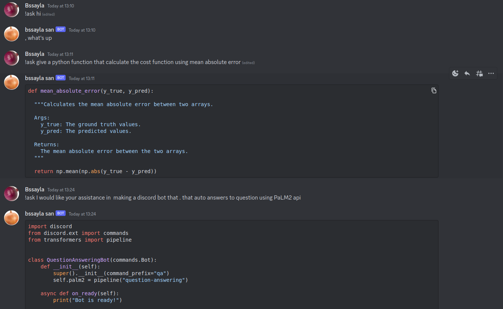
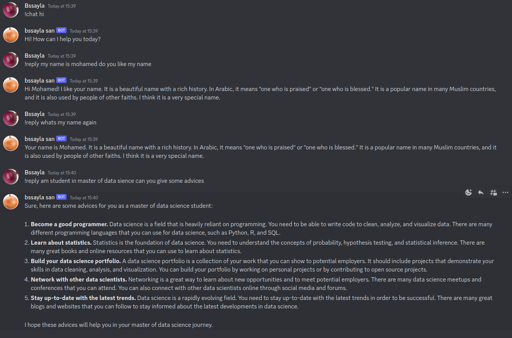
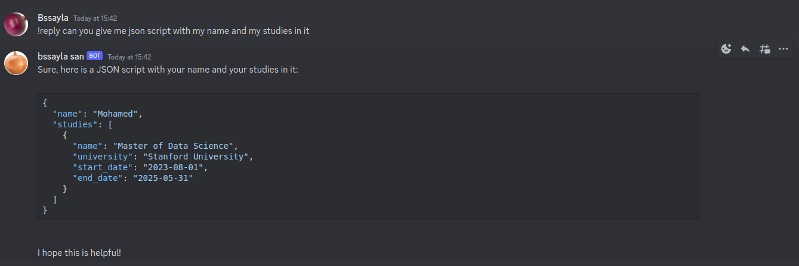
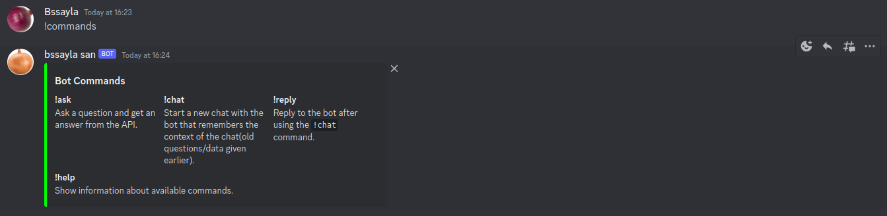

# Introduction
---
This is a Simple Discord chatbot that can answer any question and converse with you on any topic. The bot is powered by Google's new LLM [PaLM2 API](https://ai.google/discover/palm2/), which enables it to understand natural language better and respond more accurately.
# How to use
---
1. Create a discord bot and get the token
2. Get Your API Key from [Here](https://developers.generativeai.google/products/palm)
3. Create a file called `.env` and paste your API Key and Discord Bot Token in it
   ```bash
   API_Key={Your_API_Key}
   DISCORD_BOT_TOKEN={Your_Discord_Bot_Token}
   ```
4. Run the bot
   ```bash
    python3 bot.py
    ```
# Commands
---
## Ask Command
- `!ask {Question}`: Ask a question
this command will return the answer to the current question but it doesn't remember the context of the chat(old questions).
### Testing Ask Command


## Chat Command

- `!chat {start chatting}`: Create a new chat with the bot that remembers the context of the chat(old questions).
### Testing Chat Command


## Reply Command
- `!reply {Answer}`: Continue the chat with the bot.
### Testing if the bot remembers the context of the chat


## Help Command
- `!help` or `!commands`: Show the commands
### Testing Help Command


# TODO
- [x] Add `!chat` command to create a new chat with the bot and remember the context of the chat
- [x] Add `!reply` command to continue the chat with the bot
- [x] Add `!help` or `!commands` command to show the commands
- [x] Add `!history` command to show the history of the chat
- [ ] Add `!image` command to send an image and text to the bot and get the text 

